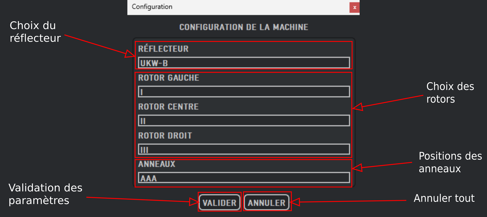
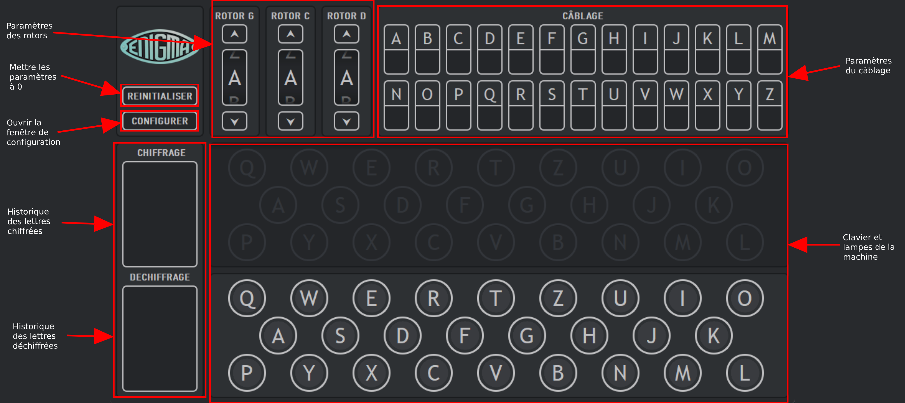

# Enigmachine - Documentation

## 1. Fenêtre de Configuration
La fenêtre de configuration permet de définir les paramètres initiaux de la machine Enigma.

- **Choix du réflecteur** : Sélection du type de réflecteur (UKW-B ou UKW-C, les deux seuls implémentés dans ce projet).
- **Choix des rotors** : Sélection des trois rotors utilisés (I, II, III, IV et V).
- **Positions des anneaux** : Définition des positions initiales des anneaux sous la forme `<ANNEAU ROTOR GAUCHE><ANNEAU ROTOR CENTRE><ANNEAU ROTOR DROIT>` (exemple: `JCB`).
- **Validation des paramètres** : Enregistrement des réglages en cliquant sur le bouton "VALIDER".
- **Annulation des modifications** : Réinitialisation des réglages en cliquant sur le bouton "ANNULER".

## 2. Fenêtre Principale
La fenêtre principale permet d'interagir avec la machine Enigma pour chiffrer et déchiffrer des messages.

### Fonctionnalités principales :
- **Paramètres des rotors** : Ajustement de la position des rotors.
- **Mise à zéro des paramètres** : Réinitialisation des réglages via le bouton "REINITIALISER".
- **Ouverture de la configuration** : Accès aux réglages avancés via "CONFIGURER".
- **Historique du chiffrement et déchiffrement** : Visualisation des lettres encodées et décodées.
- **Paramètres du câblage** : Configuration des connexions entre les lettres.
- **Clavier et lampes** : Interface de saisie et affichage des lettres chiffrées.

